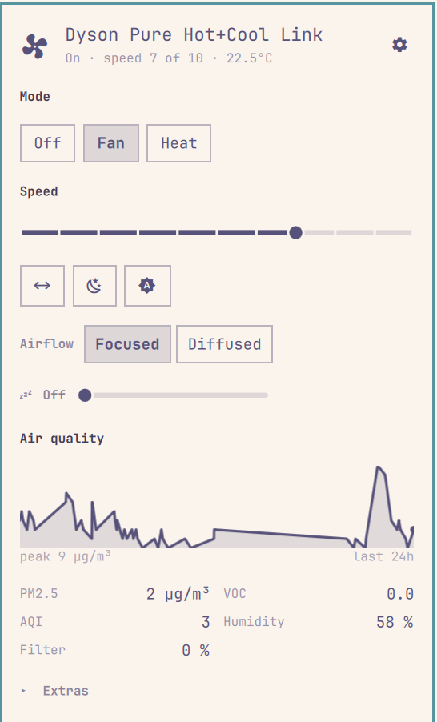

# Dyson Air for Omarchy

Control Dyson purifiers, fans, heaters and humidifiers from the Omarchy bar,
through Home Assistant.

<p align="center">
  
</p>

> Not affiliated with, sponsored by, or endorsed by Dyson, the Home Assistant
> project, or Omarchy.

## Requirements

- Omarchy 4 (`schemaVersion: 1` plugin API)
- Home Assistant with the [hass-dyson](https://github.com/cmgrayb/hass-dyson)
  integration (install through HACS, search "Dyson")
- `secret-tool` (libsecret) with a running keyring daemon. Omarchy ships
  gnome-keyring.

No Python, no vendored libraries, no helper process. One REST poll is shared
across every widget on the bar.

## Install

```bash
omarchy plugin add https://github.com/AllStars101-sudo/omarchy-dyson.git --enable
omarchy bar put io.github.allstars101-sudo.dyson-air
```

Click the fan icon and enter your Home Assistant address and a long-lived access
token (Profile → Security → Long-lived access tokens → Create token). The token
goes to your system keyring, never to a config file.

Include the scheme in the address. An address typed without one is assumed to be
`https`, and a default Home Assistant serves plain `http` on port 8123.

## Remove

```bash
omarchy bar remove io.github.allstars101-sudo.dyson-air
omarchy plugin remove io.github.allstars101-sudo.dyson-air
secret-tool clear service io.github.allstars101-sudo.dyson-air origin <your-ha-url>
rm -rf ~/.config/omarchy/io.github.allstars101-sudo.dyson-air
```

Removing the plugin does not remove your token from the keyring. The
`secret-tool clear` line does.

## Controls

| Where | Action |
|-------|--------|
| Bar, left click | Open the panel (or settings, if not yet connected) |
| Bar, middle click | Toggle power |
| Bar, scroll | Speed up / down |
| Panel | Off / Fan / Heat, target temperature, humidity, speed |
| Panel | Focused / diffused airflow, front / back direction |
| Panel | Oscillation, sweep width, tilt, sweep aiming |
| Panel | Night mode, auto mode, sleep timer |
| Panel | Heating mode, water hardness |
| Panel | PM2.5 graph, air quality readings, filter life |
| Panel | Extras: faults, filters, connection, schedule, continuous monitoring, firmware auto-update, filter reset |

Every one of those is drawn only when the device has it. Nothing is greyed out;
a control that cannot act is not there.

The panel does not scroll. A bar dropdown gives no hint that it could, so the
controls a device supports have to fit: the frequent ones are icons with
tooltips, each labelled control shares its line with its label, and the
read-only diagnostics fold into **Extras**, which opens itself when a fault is
active or a filter is due.

Omarchy's bar hotkey (Super+Ctrl+N for the Nth panel in a section) opens the
panel, not the settings overlay.

Over IPC, for keybindings:

```bash
omarchy-shell dyson-air toggle     # open/close the panel
omarchy-shell dyson-air power      # toggle power
omarchy-shell dyson-air settings
omarchy-shell dyson-air devices
```

## Settings

| Key | Default | Meaning |
|-----|---------|---------|
| `barMetric` | `Fan speed` | Bar number: `Fan speed`, `PM2.5`, or `None` |
| `historyHours` | `24` | Graph window |
| `pollSeconds` | `10` | Poll interval while every panel is closed |
| `staleSeconds` | `300` | Silence before the device counts as stale |
| `autoReconnect` | `true` | Press the reconnect button when stale |

An open panel polls every 2s regardless. PM2.5 past the WHO 24-hour guideline
(35 µg/m³) is drawn in the theme's urgent colour; nothing else is coloured by
state.

## Several devices

Add the widget once per device and assign each one in Settings → Devices.
Widgets left on *Automatic* follow the first Dyson found.

Assignment lives in Settings because two widgets of one plugin share a module
name, so only their position on the bar tells them apart, and the settings
overlay is the only surface that can see positions.

## How it decides what to show

Nothing is hardcoded per model. `hass-dyson` creates entities conditionally from
each device's capability list, so entity presence is the capability map and the
panel renders only what it finds.

Two matching rules:

- Companion switches match on an exact suffix, never a substring. A substring
  match resolves "auto mode" to `switch.<device>_firmware_auto_update`.
- Air quality sensors match on `device_class`, not name. Older models call PM2.5
  `particulates`, newer ones `pm25`. Formaldehyde is the exception, since Home
  Assistant has no HCHO device class.
- Fault sensors match on the `fault_` prefix, because which subsystems a model
  reports varies and a fixed list would miss the ones nobody here has seen.

Option lists are read off the entity too. The sweep-width chips show 45/90/180/
350 or 15/40/70 depending on the model's capability, and Breeze only where the
device offers it — none of that is written down in this plugin.

## Aiming

Oscillation is on or off in the MyDyson app. Home Assistant can do better: the
fan reports `angle_low` and `angle_high`, and hass-dyson's
`set_oscillation_angles` service sets them, so the panel offers Left, Centre,
Right and Wide plus two sliders for an arbitrary arc. Setting both ends to the
same angle holds the head still, facing that way.

The angles are absolute to the machine's own zero, not to the room, so "Left"
means the low end of its travel — which way that points depends on how the unit
is turned. Find it once and it stays put.

This goes through the service rather than the `number.*_oscillation_*_angle`
entities on purpose. Those exist only on models advertising an
`AdvanceOscillation` capability; the service has no such gate, so aiming works
on every model rather than the subset that happens to expose the entities.

## Sleep timer

The slider holds where you put it and shows `setting…` until Home Assistant
reports the device agreeing, then goes back to reporting the device. After 45
seconds it gives up waiting and shows whatever the device says.

That is not decoration. `hass-dyson` writes the sleep timer entity back only
for a value of zero; any other value waits on the device echoing `sltm`
through MQTT. On the HP02 here, over a cloud connection, that echo never
arrives — neither `number.set_value` nor the integration's own
`hass_dyson.set_sleep_timer` moves the entity off `0`, and the fan's own
`sleep_timer` attribute does not move either. So on this device the control
sends the command and then honestly reverts. Other models may well be fine;
this is upstream of the plugin either way.

## Staleness

Home Assistant keeps serving the last state it saw after a device's MQTT session
dies. Nothing errors. Suspending the machine Home Assistant runs on does this.

The newest timestamp across all of a device's entities is used as a heartbeat.
The fan entity alone is not enough: its `last_updated` only moves when the fan
changes, so an untouched fan looks identical to a dead session. After
`staleSeconds` the bar icon dims and drops its number, and with `autoReconnect`
on, the integration's reconnect button is pressed at most once every two
minutes.

## Model support

### Verified against real hardware

| Model | Type | What was exercised |
|---|---|---|
| Pure Hot+Cool Link (HP02) | 455 | Heat, speed, focused/diffused airflow, oscillation, sweep aiming, night mode, continuous monitoring, sleep timer, air quality, graph, faults, staleness, settings |

### Untested, should work

Each has a mock device in `tests/fixtures/synthetic.js` built from hass-dyson's
entity definitions. No physical unit has been connected.

| Model | Type | What the mock covers |
|---|---|---|
| Purifier Cool Formaldehyde (TP09) | 438E | Cool-only, auto as a *switch*, formaldehyde, PM10/NO₂, oscillation angle, both filters |
| Purifier Hot+Cool (HP07) | 527K | Heat via a climate entity, heating-mode select |
| Pure Humidify+Cool (PH01) | 358 | Humidifier entity, humidity target, water hardness, no heat |
| Purifier Big+Quiet (BP) | 664 | A non-ten-speed dial (12.5% steps, so 8 speeds), and a vertical tilt axis alongside the sweep |
| A minimal Link-era device | n/a | Near-empty: every optional control stays hidden rather than rendering dead |

### Recognised but not modelled

These codes resolve to a product name but have no fixture: 358E, 358K, 438,
438K, 469, 475, 520, 527, 527E.

A code missing from every table still works. It shows as `Dyson <code>`, and
controls come from the entities Home Assistant exposes.

If your device misbehaves, open an issue with:

```bash
curl -s -H "Authorization: Bearer $TOKEN" "$HA_URL/api/states" \
  | jq '[.[] | select(.entity_id|test("dyson"))]'
```

Air treatment only. Dyson robot vacuums and lights are out of scope.

## Contributing

A states dump from a model nobody here owns is the most useful contribution.

- `npm run check` runs what CI runs. It should pass before you open a pull
  request.
- Logic goes in `Dyson.js`, `View.js`, `Config.js` or `Origin.js`, not in the
  QML. Those four are the only files testable outside a running Omarchy shell,
  and the coverage gate holds them at 100%.
- New device support means a fixture, not a special case. A branch on a product
  code usually means the capability should be discovered from an entity instead.
- Write tests that would fail against a wrong implementation. Fixtures like
  `nearMiss` and `prefixSiblings` exist to stress the matchers rather than agree
  with them.
- Run `npm run lint:strict` if you have Omarchy. It catches QML problems CI
  cannot see, since a CI runner has no Quickshell to resolve types against.

Bug reports are easiest to act on with what you expected, what happened, and the
tooltip text from the bar icon, which names the failure.

## Development

```bash
npm test
npm run coverage  # tests + the 100% gate
npm run lint        # manifest, cross-file symbols, QML syntax
npm run lint:strict # the above plus full qmllint semantics (needs Omarchy)
npm run check     # all three, as CI runs them
```

No dependencies. `package.json` exists only for the scripts.

### What is and is not covered

The logic and view layers are held at 100% line, branch and function coverage,
enforced per file by `scripts/check-coverage.js`:

| File | What it holds |
|---|---|
| `Dyson.js` | Entity discovery, capability mapping, speed, air quality, model names, history, liveness, reconnect policy |
| `View.js` | Every view decision: bar label, status text, which rows exist, reading list, control options, error messages |
| `Config.js` | Config parsing, clamping, serialization |
| `Origin.js` | URL normalisation, the identity the keyring scopes tokens by |

The QML is not covered. `Panel.qml`, `Settings.qml`, `Service.qml` and
`CredentialManager.qml` hold polling, HTTP, the keyring, IPC and rendering, none
of which run outside a live Omarchy shell. They get `scripts/check-qml.sh`
instead: the manifest and its entry points, cross-file symbol references, and
QML syntax. `--strict` adds full qmllint semantics but needs the Omarchy shell
to resolve `qs.Ui`, so CI runs syntax mode. Beyond that the QML is verified by
hand against real hardware.

### Fixtures

`tests/fixtures/hp02-455.json` is a real `/api/states` dump from a Dyson Pure
Hot+Cool Link. `tests/fixtures/synthetic.js` holds hand-built dumps for models
not available here. They constrain the code but are not evidence that a real
TP09 or PH01 behaves this way.

`nearMiss` carries names that extend a wanted suffix, such as
`_night_mode_schedule`. `prefixSiblings` holds two devices whose slugs overlap.
`unavailable` holds the non-numeric states a reconnecting device emits.
`bigQuiet` uses a non-ten-speed dial.

After editing, restart the shell rather than trusting hot reload:

```bash
omarchy restart shell
```

## Licence

MIT. Portions derived from `konradk/hass`. See
[THIRD_PARTY_NOTICES.md](THIRD_PARTY_NOTICES.md).
